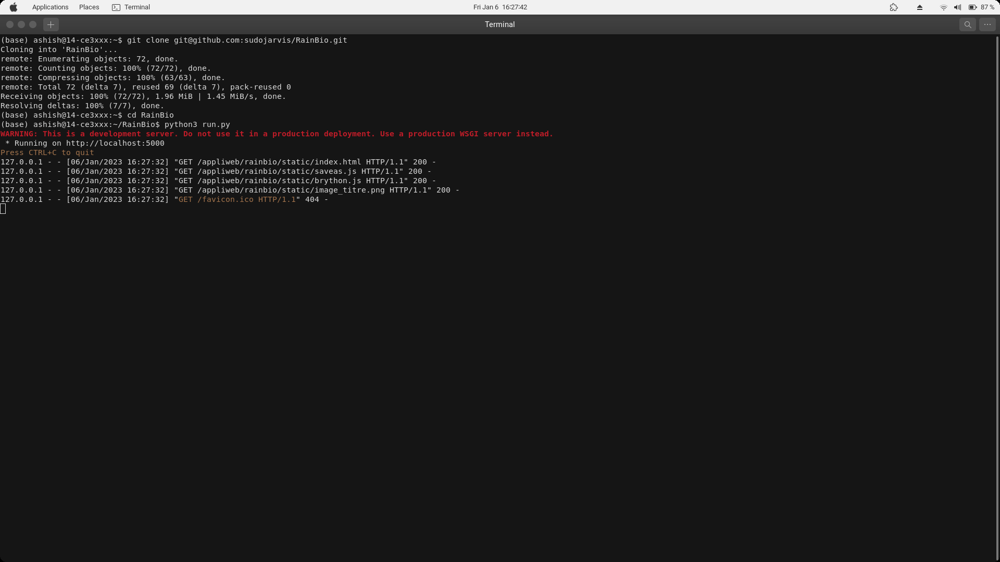
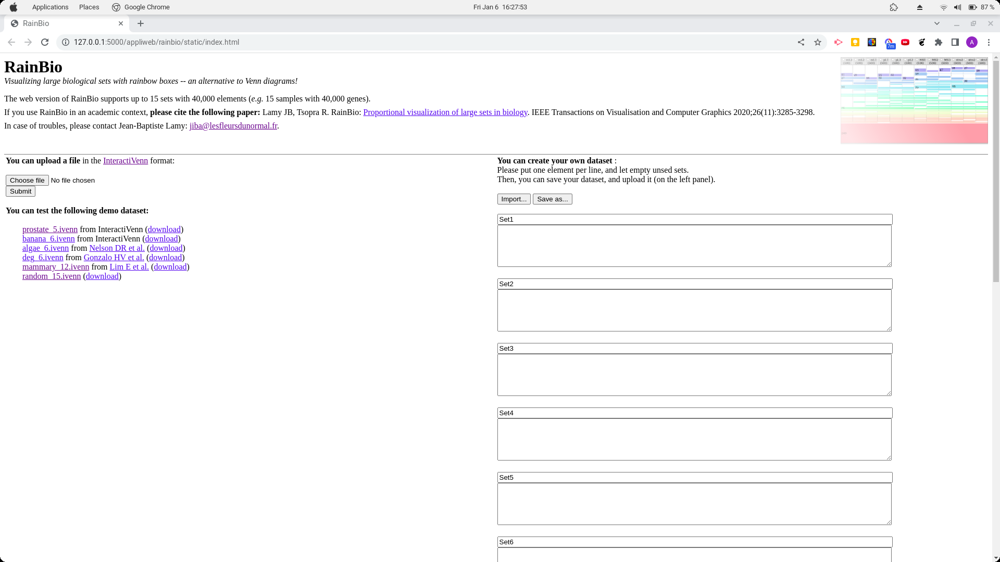

# Rainbio

## How to run
1. clone the repository or download the zip file
2. Unzip the file if you downloaded as zip
3. `cd RainBio` to go to the project directory
4. Run `python3 run.py`. This will start http://127.0.0.1:5000/appliweb/rainbio/static/index.html

